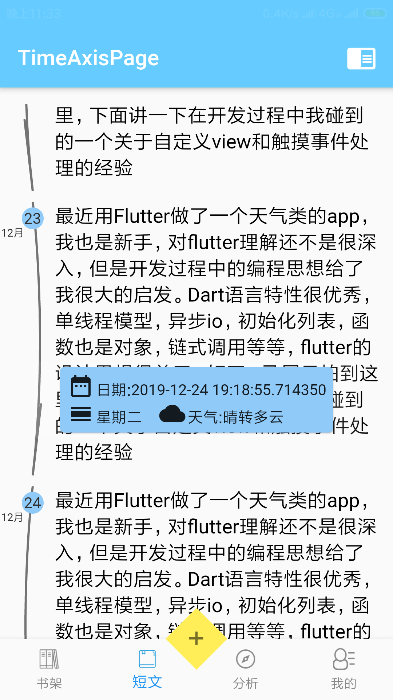
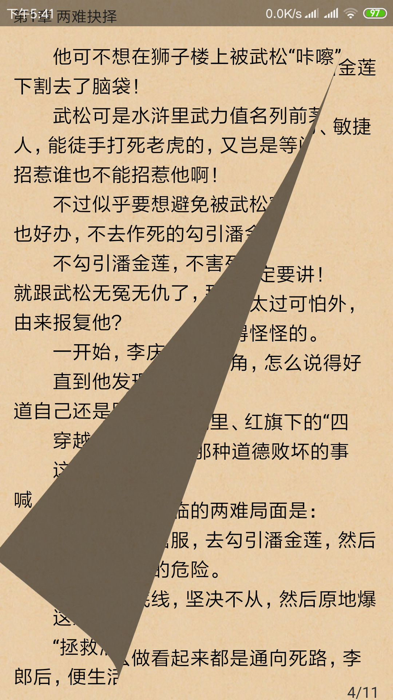

# Flutter版的阅读App

该项目建立之初的目主要是学习flutter框架，后面经过不断的功能完善，最终初步达到了自己想要的UI效果。

实现的功能主要有：

- 模拟翻页效果、滑动翻页效果以及触屏翻页等多种UI特效；
- APP登录、日志归类、时间统计、可视化数据展示、背景图片更换；
- 书籍收藏、书籍更新、书籍的阅读进度记录等功能；

### 效果展示

<figure class="third">

</figure>